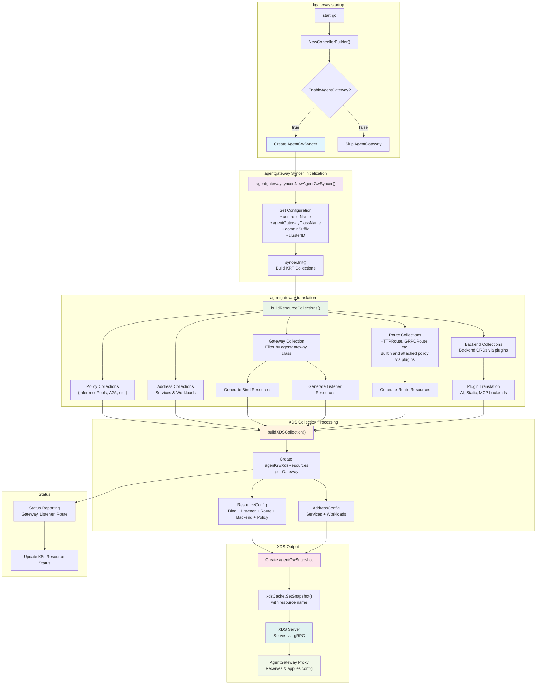

# agentgateway syncer

This syncer configures xds updates for the [agentgateway](https://agentgateway.dev/) data plane. 

To use the agentgateway control plane with kgateway, you need to enable the integration in the helm chart:
```yaml
agentGateway:
  enabled: true # set this to true
```

You can configure the agentgateway Gateway class to use a specific image by setting the image field on the 
GatewayClass:
```yaml
kind: GatewayParameters
apiVersion: gateway.kgateway.dev/v1alpha1
metadata:
  name: kgateway
spec:
  kube:
    agentGateway:
      enabled: true
      logLevel: debug
      image:
        tag: bc92714
---
kind: GatewayClass
apiVersion: gateway.networking.k8s.io/v1
metadata:
  name: agentgateway
spec:
  controllerName: kgateway.dev/kgateway
  parametersRef:
    group: gateway.kgateway.dev
    kind: GatewayParameters
    name: kgateway
    namespace: default
---
kind: Gateway
apiVersion: gateway.networking.k8s.io/v1
metadata:
  name: agent-gateway
spec:
  gatewayClassName: agentgateway
  listeners:
    - protocol: HTTP
      port: 8080
      name: http
      allowedRoutes:
        namespaces:
          from: All
```

### APIs

The syncer uses the following APIs:

- [workload](https://github.com/agentgateway/agentgateway/tree/main/go/api/workload.pb.go)
- [resource](https://github.com/agentgateway/agentgateway/tree/main/go/api/resource.pb.go)

The workload API is originally derived from from Istio's [ztunnel](https://github.com/istio/ztunnel), where each address represents a unique address. The address API joins two sub-resources (Workload and Service) to support querying by IP address.

Resources contain agentgateway-specific config (Binds, Listeners, Routes, Backend, Policy, etc.).

#### Bind: 

Bind resources define port bindings that associate gateway listeners with specific network ports. Each Bind contains:
- **Key**: Unique identifier in the format `port/namespace/name` (e.g., `8080/default/my-gateway`)
- **Port**: The network port number that the gateway listens on

Binds are created automatically when Gateway resources are processed, with one Bind per unique port used across all listeners. 

#### Listener:

Listener resources represent individual gateway listeners with their configuration. Each Listener contains:
- **Key**: Unique identifier for the listener
- **Name**: The section name from the Gateway listener specification  
- **BindKey**: References the associated Bind resource (format: `port/namespace/name`)
- **GatewayName**: The gateway this listener belongs to (format: `namespace/name`)
- **Hostname**: The hostname this listener accepts traffic for
- **Protocol**: The protocol type (HTTP, HTTPS, TCP, TLS)
- **TLS**: TLS configuration including certificates and termination mode

Listeners are created from Gateway API listener specifications and define how traffic is accepted and processed at the network level.

#### Routes:

Route resources define routing rules that determine how traffic is forwarded to backend services. Routes are created from various Gateway API route types:

- **HTTP Routes**: Convert from `HTTPRoute` resources with path, header, method, and query parameter matching
- **gRPC Routes**: Convert from `GRPCRoute` resources with service/method matching  
- **TCP Routes**: Convert from `TCPRoute` resources for TCP traffic (catch-all matching)
- **TLS Routes**: Convert from `TLSRoute` resources for TLS passthrough (SNI matching at listener level)

Each Route contains:
- **Key**: Unique identifier (format: `namespace.name.rule.match`)
- **RouteName**: Source route name (format: `namespace/name`)  
- **ListenerKey**: Associated listener (populated during gateway binding)
- **RuleName**: Optional rule name from the source route
- **Matches**: Traffic matching criteria (path, headers, method, query params)
- **Filters**: Request/response transformation filters
- **Backends**: Target backend services with load balancing and health checking
- **Hostnames**: Hostnames this route serves traffic for

Routes support various filters including header modification, redirects, URL rewrites, request mirroring, and policy attachments.

#### Backends:

Backend resources define target services and systems that traffic should be routed to. Unlike other resources, backends are global resources (not per-gateway) and are applied to all gateways in the agentgateway syncer.

Each backend has a unique name in the format `namespace/name`. Backends are processed through the plugin system that translates Kubernetes Backend CRDs to agentgateway API resources

Backends in kgateway are represented by the Backend CRD and support multiple backend types:

**Backend Types:**
- **AI**: Routes traffic to AI/LLM providers (OpenAI, Anthropic, etc.) with model-specific configurations
- **Static**: Routes to static host/IP with configurable ports and protocols. Note: In agentgateway only one host is supported (not list of hosts). 
- **MCP**: Model Context Protocol backends for virtual MCP servers. Note if a static MCP backend target is used, kgateway will translate out two backends (one static, one mcp).

**Usage in Routes:**
Backends are referenced by HTTPRoute, GRPCRoute, TCPRoute, and TLSRoute resources using `backendRefs`:

```yaml
apiVersion: gateway.networking.k8s.io/v1
kind: HTTPRoute
spec:
  rules:
    - backendRefs:
        - group: gateway.kgateway.dev
          kind: Backend
          name: my-backend
```

**Translation Process:**
1. Backend CRDs are watched by the agentgateway syncer
2. Each backend is processed through registered plugins based on its type
3. Plugins translate the backend configuration to agentgateway API format
4. The resulting backend resources and associated policies are distributed to **all** gateways via xDS

#### Policies:

Policies in kgateway can come from HTTPRoutes, Backends and TrafficPolicy crds. They configure the following agentgateway Policies:

Policies are configurable rules that control traffic behavior, security, and transformations for routes and backends.
- Request Header Modifier: Add, set, or remove HTTP request headers.
- Response Header Modifier: Add, set, or remove HTTP response headers.
- Request Redirect: Redirect incoming requests to a different scheme, authority, path, or status code.
- URL Rewrite: Rewrite the authority or path of requests before forwarding.
- Request Mirror: Mirror a percentage of requests to an additional backend for testing or analysis.
- CORS: Configure Cross-Origin Resource Sharing (CORS) settings for allowed origins, headers, methods, and credentials.
- A2A: Enable agent-to-agent (A2A) communication features.
- Backend Auth: Set up authentication for backend services (e.g., passthrough, key, GCP, AWS).
- Timeout: Set request and backend timeouts.
- Retry: Configure retry attempts, backoff, and which response codes should trigger retries.

### Architecture 

The agentgateway syncer only runs if `cfg.SetupOpts.GlobalSettings.EnableAgentGateway` is set. Otherwise,
only the Envoy proxy syncer will run by default. 



### Conformance tests

Setup the cluster:

```shell
AGENTGATEWAY=true ./hack/kind/setup-kind.sh
```

Retag and load the image to match the default image tag in the values file for agentgateway, then run:

```
make run HELM_ADDITIONAL_VALUES=test/kubernetes/e2e/tests/manifests/agent-gateway-integration.yaml; CONFORMANCE_GATEWAY_CLASS=agentgateway make conformance 
```

## Examples 

Set up a kind cluster and install kgateway with the kubernetes Gateway APIs:
```shell
kubectl apply -f https://github.com/kubernetes-sigs/gateway-api/releases/download/v1.3.0/experimental-install.yaml

helm upgrade -i -n kgateway-system kgateway-crds ./_test/kgateway-crds-1.0.0-ci1.tgz --create-namespace

helm upgrade -i -n kgateway-system kgateway ./_test/kgateway-1.0.0-ci1.tgz --create-namespace --values test/kubernetes/e2e/tests/manifests/agent-gateway-integration.yaml
```

#### HTTPRoute

Apply the httpbin test app:
```shell
kubectl apply -f  test/kubernetes/e2e/defaults/testdata/httpbin.yaml 
```

Apply the following config to set up the HTTPRoute attached to the agentgateway Gateway:

```shell
kubectl apply -f- <<EOF
kind: Gateway
apiVersion: gateway.networking.k8s.io/v1
metadata:
  name: agent-gateway
spec:
  gatewayClassName: agentgateway
  listeners:
    - protocol: HTTP
      port: 8080
      name: http
      allowedRoutes:
        namespaces:
          from: All
---
apiVersion: gateway.networking.k8s.io/v1
kind: HTTPRoute
metadata:
  name: httpbin
  labels:
    example: httpbin-route
spec:
  parentRefs:
    - name: agent-gateway
      namespace: default
  hostnames:
    - "www.example.com"
  rules:
    - backendRefs:
        - name: httpbin
          port: 8000
EOF
```

Port-forward and send a request through the gateway:
```shell
 curl localhost:8080 -v -H "host: www.example.com"
```

#### GRPC Route

Apply the following config to set up the GRPCRoute attached to the agentgateway Gateway:
```shell
kubectl apply -f- <<EOF
kind: Gateway
apiVersion: gateway.networking.k8s.io/v1
metadata:
  name: agent-gateway
spec:
  gatewayClassName: agentgateway
  listeners:
    - protocol: HTTP
      port: 8080
      name: http
      allowedRoutes:
        namespaces:
          from: All
---
apiVersion: gateway.networking.k8s.io/v1
kind: GRPCRoute
metadata:
  name: grpc-route
spec:
  parentRefs:
    - name: agent-gateway
  hostnames:
    - "example.com"
  rules:
    - matches:
        - method:
            method: ServerReflectionInfo
            service: grpc.reflection.v1alpha.ServerReflection
        - method:
            method: Ping
      backendRefs:
        - name: grpc-echo-svc
          port: 3000
---
apiVersion: apps/v1
kind: Deployment
metadata:
  name: grpc-echo
spec:
  selector:
    matchLabels:
      app: grpc-echo
  replicas: 1
  template:
    metadata:
      labels:
        app: grpc-echo
    spec:
      containers:
        - name: grpc-echo
          image: ghcr.io/projectcontour/yages:v0.1.0
          ports:
            - containerPort: 9000
              protocol: TCP
          env:
            - name: POD_NAME
              valueFrom:
                fieldRef:
                  fieldPath: metadata.name
            - name: NAMESPACE
              valueFrom:
                fieldRef:
                  fieldPath: metadata.namespace
            - name: GRPC_ECHO_SERVER
              value: "true"
            - name: SERVICE_NAME
              value: grpc-echo
---
apiVersion: v1
kind: Service
metadata:
  name: grpc-echo-svc
spec:
  type: ClusterIP
  ports:
    - port: 3000
      protocol: TCP
      targetPort: 9000
      appProtocol: kubernetes.io/h2c
  selector:
    app: grpc-echo
---
apiVersion: v1
kind: Pod
metadata:
  name: grpcurl-client
spec:
  containers:
    - name: grpcurl
      image: docker.io/fullstorydev/grpcurl:v1.8.7-alpine
      command:
        - sleep
        - "infinity"
EOF
```

Port-forward, and send a request through the gateway:
```shell
grpcurl \
  -plaintext \
  -authority example.com \
  -d '{}' localhost:8080 yages.Echo/Ping 
```

#### TCPRoute

Apply the following config to set up the TCPRoute attached to the agentgateway Gateway:
```shell
kubectl apply -f- <<EOF
kind: Gateway
apiVersion: gateway.networking.k8s.io/v1
metadata:
  name: tcp-gw-for-test
spec:
  gatewayClassName: agentgateway
  listeners:
    - name: tcp
      protocol: TCP
      port: 8080
      allowedRoutes:
        kinds:
          - kind: TCPRoute
---
apiVersion: gateway.networking.k8s.io/v1alpha2
kind: TCPRoute
metadata:
  name: tcp-app-1
spec:
  parentRefs:
    - name: tcp-gw-for-test
  rules:
    - backendRefs:
        - name: tcp-backend
          port: 3001
---
apiVersion: apps/v1
kind: Deployment
metadata:
  name: tcp-backend
spec:
  replicas: 1
  selector:
    matchLabels:
      app: tcp-backend
      version: v1
  template:
    metadata:
      labels:
        app: tcp-backend
        version: v1
    spec:
      containers:
        - image: gcr.io/k8s-staging-gateway-api/echo-basic:v20231214-v1.0.0-140-gf544a46e
          imagePullPolicy: IfNotPresent
          name: tcp-backend
          ports:
            - containerPort: 3000
          env:
            - name: POD_NAME
              valueFrom:
                fieldRef:
                  fieldPath: metadata.name
            - name: NAMESPACE
              valueFrom:
                fieldRef:
                  fieldPath: metadata.namespace
            - name: SERVICE_NAME
              value: tcp-backend
---
apiVersion: v1
kind: Service
metadata:
  name: tcp-backend
  labels:
    app: tcp-backend
spec:
  ports:
    - name: http
      port: 3001
      targetPort: 3000
  selector:
    app: tcp-backend
EOF
```

Port-forward, and send a request through the gateway:
```shell
curl localhost:8080/ -i
```

#### Static Backend routing

Apply the following config to set up the HTTPRoute pointing to the static backend:

```shell
kubectl apply -f- <<EOF
kind: Gateway
apiVersion: gateway.networking.k8s.io/v1
metadata:
  name: gw
spec:
  gatewayClassName: agentgateway
  listeners:
    - protocol: HTTP
      port: 8080
      name: http
      allowedRoutes:
        namespaces:
          from: All
---
apiVersion: gateway.networking.k8s.io/v1beta1
kind: HTTPRoute
metadata:
  name: json-route
spec:
  parentRefs:
    - name: gw
  hostnames:
    - "jsonplaceholder.typicode.com"
  rules:
    - backendRefs:
        - name: json-backend
          kind: Backend
          group: gateway.kgateway.dev
---
apiVersion: gateway.kgateway.dev/v1alpha1
kind: Backend
metadata:
  name: json-backend
spec:
  type: Static
  static:
    hosts:
      - host: jsonplaceholder.typicode.com
        port: 80
EOF
```

Port-forward, and send a request through the gateway:
```shell
curl localhost:8080/ -v -H "host: jsonplaceholder.typicode.com"
```

#### AI Backend routing

First, create secret in the cluster with the API key:
```shell
kubectl create secret generic openai-secret \
--from-literal="Authorization=Bearer $OPENAI_API_KEY" \
--dry-run=client -oyaml | kubectl apply -f -
```

Apply the following config to set up the HTTPRoute pointing to the AI Backend:
```shell
kubectl apply -f- <<EOF
kind: Gateway
apiVersion: gateway.networking.k8s.io/v1
metadata:
  name: agent-gateway
spec:
  gatewayClassName: agentgateway
  listeners:
    - protocol: HTTP
      port: 8080
      name: http
      allowedRoutes:
        namespaces:
          from: All
---
apiVersion: gateway.networking.k8s.io/v1
kind: HTTPRoute
metadata:
  name: openai
  labels:
    example: openai-route
spec:
  parentRefs:
    - name: agent-gateway
      namespace: default
  rules:
    - matches:
        - path:
            type: PathPrefix
            value: /openai
      backendRefs:
        - name: openai
          group: gateway.kgateway.dev
          kind: Backend
---
apiVersion: gateway.kgateway.dev/v1alpha1
kind: Backend
metadata:
  labels:
    app: kgateway
  name: openai
spec:
  type: AI
  ai:
    llm:
      provider:
        openai:
          model: "gpt-4o-mini"
          authToken:
            kind: "SecretRef"
            secretRef:
              name: openai-secret
EOF
```

Port-forward, and send a request through the gateway:
```shell
curl localhost:8080/openai -H content-type:application/json -v -d'{
"model": "gpt-3.5-turbo",
"messages": [
  {
    "role": "user",
    "content": "Whats your favorite poem?"
  }
]}'
```

#### MCP Backend 

Apply the following config to set up the HTTPRoute pointing to the MCP Backend:
```shell
kubectl apply -f- <<EOF
kind: Gateway
apiVersion: gateway.networking.k8s.io/v1
metadata:
  name: agent-gateway
spec:
  gatewayClassName: agentgateway
  listeners:
    - protocol: HTTP
      port: 8080
      name: http
      allowedRoutes:
        namespaces:
          from: All
---
apiVersion: gateway.networking.k8s.io/v1
kind: HTTPRoute
metadata:
  name: mcp
  labels:
    example: mcp-route
spec:
  parentRefs:
    - name: agent-gateway
      namespace: default
  hostnames:
    - "www.example.com"
  rules:
    - backendRefs:
        - name: mcp-backend
          group: gateway.kgateway.dev
          kind: Backend
---
apiVersion: gateway.kgateway.dev/v1alpha1
kind: Backend
metadata:
  labels:
    app: kgateway
  name: mcp-backend
spec:
  type: MCP
  mcp:
    name: mcp-server
    targets:
      - selectors:
          serviceSelector:
            matchLabels:
              app: mcp-website-fetcher
---
apiVersion: apps/v1
kind: Deployment
metadata:
  name: mcp-website-fetcher
  labels:
    app: mcp-website-fetcher
spec:
  replicas: 1
  selector:
    matchLabels:
      app: mcp-website-fetcher
  template:
    metadata:
      labels:
        app: mcp-website-fetcher
    spec:
      containers:
        - name: mcp-website-fetcher
          image: ghcr.io/peterj/mcp-website-fetcher:main
          imagePullPolicy: Always
          ports:
            - containerPort: 8000
          resources:
            limits:
              cpu: "500m"
              memory: "256Mi"
            requests:
              cpu: "100m"
              memory: "128Mi"
          livenessProbe:
            httpGet:
              path: /sse
              port: 8000
            initialDelaySeconds: 10
            periodSeconds: 30
---
apiVersion: v1
kind: Service
metadata:
  name: mcp-website-fetcher
  labels:
    app: mcp-website-fetcher
spec:
  selector:
    app: mcp-website-fetcher
  ports:
    - port: 80
      targetPort: 8000
      appProtocol: kgateway.dev/mcp
  type: ClusterIP
EOF
```

Port-forward, and send a request through the gateway:
```shell
curl localhost:8080/sse -v -H "host: www.example.com"
```

You can also use static targets. This will create two backends 1) static backend for the target, 2) mcp backend.

Apply the following config to set up the HTTPRoute pointing to the MCP Backend with a static target:
```shell
kubectl apply -f- <<EOF
apiVersion: gateway.kgateway.dev/v1alpha1
kind: Backend
metadata:
  labels:
    app: kgateway
  name: mcp-backend
spec:
  type: MCP
  mcp:
    name: mcp-server
    targets:
      - static:
          name: mcp-target
          host: mcp-website-fetcher.default.svc.cluster.local
          port: 8000
          protocol: StreamableHTTP
EOF
```

#### A2A Backend 

Build the sample kgateway a2a application and load it into the kind cluster with `VERSION=$VERSION make kind-build-and-load-test-a2a-agent`.

Apply the sample app:
```shell
kubectl apply -f- <<EOF
apiVersion: apps/v1
kind: Deployment
metadata:
  name: a2a-agent
  labels:
    app: a2a-agent
spec:
  selector:
    matchLabels:
      app: a2a-agent
  template:
    metadata:
      labels:
        app: a2a-agent
    spec:
      containers:
        - name: a2a-agent
          image: ghcr.io/kgateway-dev/test-a2a-agent:1.0.0-ci1
          ports:
            - containerPort: 9090
---
apiVersion: v1
kind: Service
metadata:
  name: a2a-agent
spec:
  selector:
    app: a2a-agent
  type: ClusterIP
  ports:
    - protocol: TCP
      port: 9090
      targetPort: 9090
      appProtocol: kgateway.dev/a2a
EOF
```

Note, you must use `kgateway.dev/a2a` as the app protocol for the kgateway control plane to configure agentgateway to use a2a.

Apply the routing config:
```shell
kubectl apply -f- <<EOF
kind: Gateway
apiVersion: gateway.networking.k8s.io/v1
metadata:
  name: agent-gateway
spec:
  gatewayClassName: agentgateway
  listeners:
    - protocol: HTTP
      port: 8080
      name: http
      allowedRoutes:
        namespaces:
          from: All
---
apiVersion: gateway.networking.k8s.io/v1
kind: HTTPRoute
metadata:
  name: a2a
  labels:
    example: a2a-route
spec:
  parentRefs:
    - name: agent-gateway
      namespace: default
  rules:
    - backendRefs:
        - name: a2a-agent
          port: 9090
EOF
```

Port-forward, and send a request through the gateway:
```shell
 curl -X POST http://localhost:8080/ \
-H "Content-Type: application/json" \
  -v \
  -d '{
"jsonrpc": "2.0",
"id": "1",
"method": "tasks/send",
"params": {
  "id": "1",
  "message": {
    "role": "user",
    "parts": [
      {
        "type": "text",
        "text": "hello gateway!"
      }
    ]
  }
}
}'
```